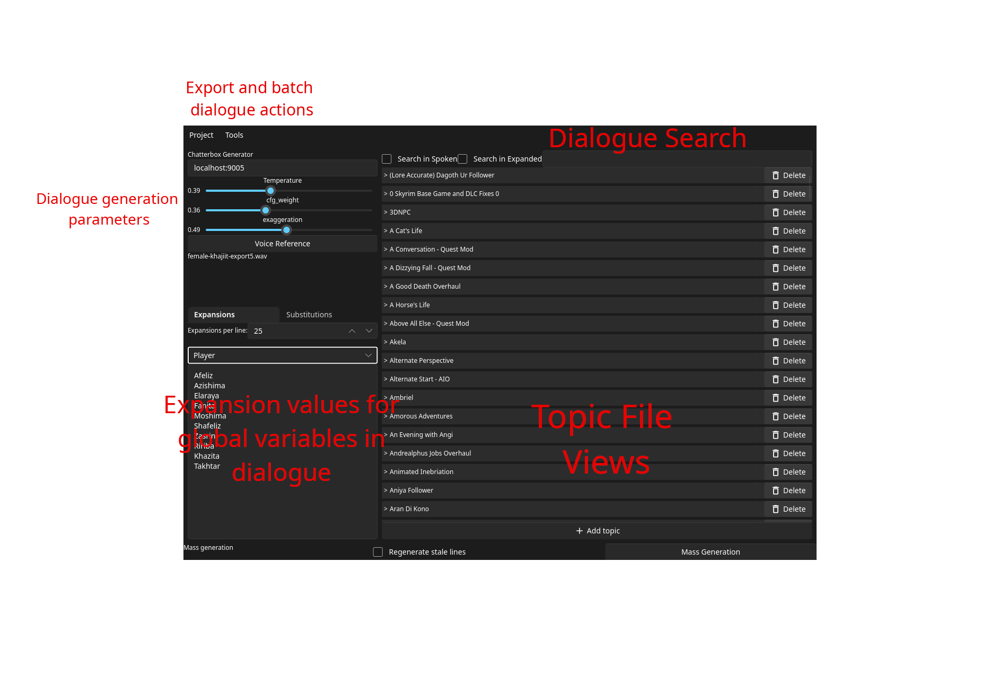
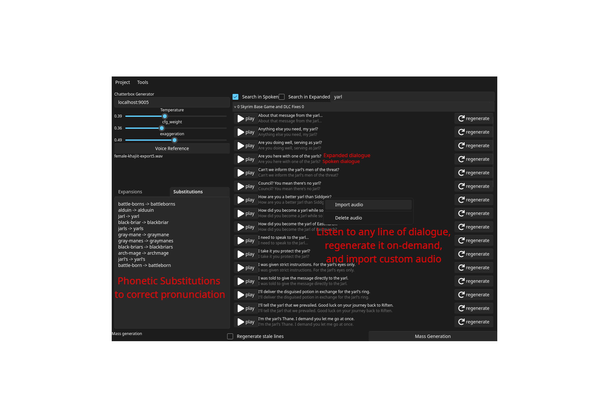

# VOSpeaker
Generate, listen to, and package voicelines using AI backends.

This program allows the automatic generation of thousands of voicelines across hundreds of topic files. 

For the dialogue lines, it takes care of:
- voiceline cleanup
- global variable substitution
- dialogue tweaking for pronunciaiton hints

For audio generation, it takes care of:
- connecting to the audio generation model to produce an audio file
- importing of any custom audio file supported by ffmpeg (basically all of them)
- converting between audio formats whenever needed
- generation of lip, xwm, and fuz files for each line of dialogue

For project organization, it takes care of:
- topic/voiceline inspection. You can quickly find any line of dialogue
- both automatic mass generation and manual regeneration
- project separation
  - All configuration is per-project, so they won't interfere with each other 
- exporting to:
  - Raw DBVO mod
  - FOMOD structured like a reference FOMOD
  - Loose audio files

## Screenshots



## Miscellaneous Documentation
### VO generation directory structure
The vospeaker project stores dialogue files as mp3 files with a bitrate defined in audio_conversion.rs::MP3_BITRATE.
Conversion to/from mp3 happens via ffmpeg.
```
project_name.vospeaker/
├─ expansions.toml
├─ substitutions.toml
├─ chatterbox-generator-config.toml
├─ last-fomod-paths.toml
├─ topics/
│  ├─ topic_file1.topic.d/
│  │  ├─ topic_file1.topic
│  │  ├─ configMap.bin
│  │  ├─ 5e03377018ec6bf3.mp3
│  │  └─ ae7dc5e7ebb805ff.mp3
│  ├─ topic_file2.topic.d/
│  │  ├─ topic_file2.topic
│  │  ├─ configMap.bin
│  │  ├─ 5e03377018ec6bf3.mp3
│  │  └─ ae7dc5e7ebb805ff.mp3
```

#### <generator_name>-generator-config.toml
arbitrary file for serialized VO generator settings.

#### substitutions.toml
TOML file containing a serialized HashMap<String, String> which represents words (keys) that should be replaced with
another word (or nothing) when the dialogue passed to the generator to be spoken.

#### expansions.toml
TOML file containing a serialized HashMap<String, Vec<String>> which represents the possible values a given global
variable/alias could represent. The elements of the Vec replace the <global=someName> fields that appear in
dialogue lines. Each raw line is "expanded" into the permutations of the possible substitutions of its contained
globals.

#### configMap.bin
stores the mapping from vo hash to the hash of the config used to generate it.
This allows distinguishing between vo files that were generated with an "old" config.
see `config_map_file.rs` for details on the format.

#### *.topic
newline-separated list of dialogue lines that should be spoken

### Dialog Processing
dialog has 3 forms:
1. raw, unsubstituted
    - `I have completed the quest at <alias=questLocation>. (500 gold)`
2. substituted
   - Substitutions can create several variants of the same dialog
   - `I have completed the quest at Whiterun for the Jarl. (500 gold)`
   - `I have completed the quest at Rorikstead for the Jarl. (500 gold)`
3. Phonetically substituted and trimmed
   - Some words are very difficult to pronounce, and can be replaced with phonetic synonyms when sent to the VO generator.
   - `I have completed the quest at Rorikstead for the yarl. (500 gold)` (Jarl -> yarl)
   - Some portions of text shouldn't be spoken, and will be removed when sent to the VO generator
   - `I have completed the quest at Rorikstead for the yarl.`

### Export to fuz process:
1. make wav file with bits per sample=16
2. create .xwm file
   1. `xWMAEncode.exe "C:\input.wav" "C:\output.xwm"`
3. create .lip file
   1. `FaceFXWrapper.exe "Skyrim" "USEnglish" "C:\FonixData.cdf" "C:\input.wav" "C:\input_resampled.wav" "C:\output.lip" "Clean text spoken by the model"`
      - I don't know what the resampling process actually does; it seems to be built into the faceFx interface, which doesn't have clear documentation. I.E. I can't guarantee that it's just keeping the wav to 16 bits per sample.
3. combine .xwm and .lip file into a .fuz file using xwmaencode.exe
   4. `BmlFuzEncode.exe "C:\output.fuz" "C:\input.xwm" "C:\input.lip"`
      - The lip file is not necessary if `-nolip` is passed in its place

### DBVO export format:
```
<pack_name>/
├── DragonbornVoiceOver/
│   └── voice_packs/
│       └── <pack_id>.json (manifest)
└── Sound/
    └── DBVO/
        └── <pack_id>/
            ├── line1.fuz
            └── line2.fuz
```

### WINE notes:
   The conversion to .fuz files uses several programs via wine. This requires a valid wine prefix with MVSC and wine-mono installed.
   Setting this up automatically may later be added as a feature. If you're using Linux, you will probably already have a good wine setup anyways.